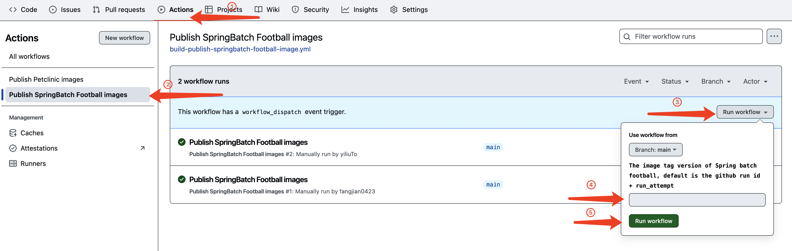

# Launch your Spring Batch Jobs in Azure Container App Jobs

## Overview
This is the companion repository for the [Azure Container Apps Spring Batch quickstart](https://learn.microsoft.com/azure/container-apps/java-springbatch-get-started). This repository contains Java samples that demonstrate how to build your own images and deploy to Azure Container App Jobs.

## Build your own images and deploy to Azure Container App Jobs

In [Azure Container Apps Spring Batch quickstart](https://learn.microsoft.com/azure/container-apps/java-springbatch-get-started), you're using our [built images](https://github.com/orgs/Azure-Samples/packages?q=spring-petclinic&tab=packages&q=spring-batch-football) for the Spring Batch Job.

1. Fork your own copy of [Azure-samples/azure-container-apps-java-samples](https://github.com/Azure-Samples/azure-container-apps-java-samples) by clicking the Fork button in the upper right corner of the repository.

2. Go to spring-batch-football directory in your forked repository, modify the code and push to your forked repository.

3. Go to your forked `azure-container-apps-java-samples` repository, navigate to the `GitHub Actions` tab, choose `Publish SpringBatch Football images` workflow, and click `Run workflow`. The image tag version is optional for your customized images, you can leave it empty to use the default value `latest`.

4. After the workflow finished, go to the `Code` tab of your `azure-container-apps-java-samples` repository, click the `Packages` button at the right bottom corner to see the built images.

5. There should be one package. Click on the package name to see the details of the package. Update or create your container apps with these images as how [Azure Container Apps Spring Batch quickstart](https://learn.microsoft.com/azure/container-apps/java-springbatch-get-started) does.  
